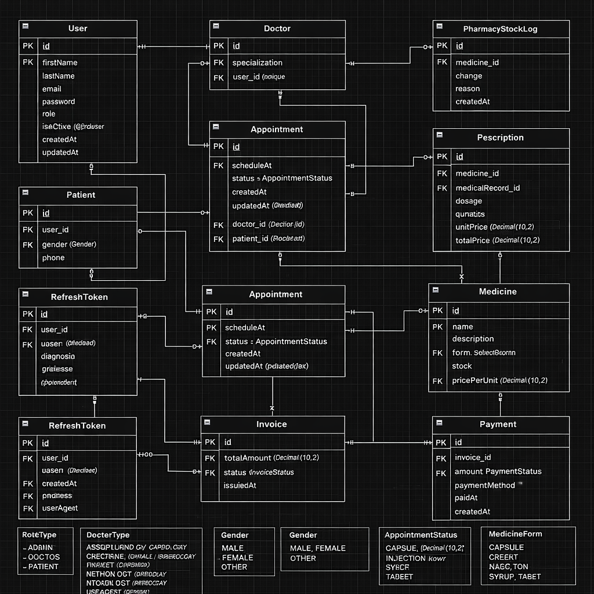

# 🏥 CC20 – PoRPaI Health Care System (Backend)

Backend API สำหรับระบบจัดการโรงพยาบาล
พัฒนาโดยใช้ Node.js + Express + Prisma + PostgreSQL

รองรับระบบ:

• ระบบผู้ใช้งาน (Admin / Doctor / Patient)
• ระบบนัดหมาย
• ระบบบันทึกการรักษา
• ระบบสั่งยา
• ระบบจัดการสต็อกยา
• ระบบออกใบแจ้งหนี้และชำระเงิน
• Role-based Access Control (RBAC)

## 📌 Tech Stack

• Node.js
• Express.js
• Prisma ORM
• PostgreSQL
• JWT Authentication
• Role-based Authorization

## 🧠 System Overview

#### 1️⃣ User System

• ใช้ตาราง User ร่วมกันทุก Role (ADMIN, DOCTOR, PATIENT)
• แยกข้อมูล Doctor และ Patient ออกเป็นคนละตาราง
• Admin เป็นผู้สร้าง Doctor
• Patient สมัครเองได้
• Login → ตรวจสอบ role → เข้าหน้า dashboard ตามสิทธิ์

#### 2️⃣ Appointment System

• Admin เป็นผู้สร้างนัดหมาย
• Appointment เชื่อมกับ Doctor และ Patient
• ป้องกันการจองซ้ำ (Doctor + ScheduleAt unique)
• Doctor และ Patient ดูเฉพาะของตนเองได้

#### 3️⃣ Medical Record & Prescription

• Doctor สร้าง Medical Record จาก Appointment
• 1 Appointment = 1 Medical Record
• 1 Medical Record สามารถมีหลาย Prescription
• Prescription บันทึกราคา snapshot ป้องกันราคาเปลี่ยนย้อนหลัง

#### 4️⃣ Medicine & Stock Management

• Medicine เก็บข้อมูลยา + ราคา + stock
• ทุกการเปลี่ยนแปลง stock ต้องบันทึกใน StockLog
• รองรับ transaction ป้องกัน stock ติดลบ

#### 5️⃣ Billing System

• หลังรักษา → สร้าง Invoice
• Invoice สามารถมีหลาย Payment
• รองรับ partial payment / retry / refund
• Patient ดูสถานะการเงินของตนเองได้

## 🔐 Role-Based Access Control

| Role    | Access                                                |
| :------ | :---------------------------------------------------- |
| ADMIN   | จัดการทุกระบบ                                         |
| DOCTOR  | ดู appointment ตัวเอง / สร้าง medical record / สั่งยา |
| PATIENT | ดู appointment / medical record / invoice ของตัวเอง   |

## 📂 API Structure

#### 🔑 AUTH MODULE

| Method | Endpoint                          | Auth   | Description            |
| ------ | --------------------------------- | ------ | ---------------------- |
| POST   | `/api/auth/signin`                | Public | Login                  |
| POST   | `/api/auth/signup/patient`        | Public | Register patient       |
| POST   | `/api/auth/signup/doctor`         | ADMIN  | Create doctor          |
| GET    | `/api/auth/me`                    | USER   | Get current user       |
| GET    | `api/auth/refresh-token`          | Public | Refresh token          |
| POST   | `/api/auth/forgot-password`       | Public | Send reset link        |
| POST   | `/api/auth/reset-password/:token` | Public | Reset password         |
| GET    | `/api/public/doctors`             | Public | Get public doctor list |

#### 👨‍⚕️ DOCTOR (Admin Only)

| Method | Endpoint                      | Description        |
| ------ | ----------------------------- | ------------------ |
| GET    | `/api/doctors`                | Get all doctors    |
| GET    | `/api/doctors/:id`            | Get doctor by id   |
| PUT    | `/api/doctors/:id`            | Update doctor      |
| PATCH  | `/api/doctors/:id/deactivate` | Soft delete doctor |

#### 🧑‍⚕️ PATIENT (Admin Only)

| Method | Endpoint                       | Description         |
| ------ | ------------------------------ | ------------------- |
| GET    | `/api/patients`                | Get all patients    |
| GET    | `/api/patients/:id`            | Get patient by id   |
| PUT    | `/api/patients/:id`            | Update patient      |
| PATCH  | `/api/patients/:id/deactivate` | Soft delete patient |

### 📅 APPOINTMENT

| Method | Endpoint                       |
| ------ | ------------------------------ |
| GET    | `/api/appointments`            |
| POST   | `/api/appointments`            |
| PUT    | `/api/appointments/:id`        |
| PATCH  | `/api/appointments/:id/status` |
| DELETE | `/api/appointments/:id`        |

Example:

- [examples/appointment.json](examples/appointment.json)

Doctor
| Method | Endpoint |
| ------ | -------------------------- |
| GET | `/api/doctor/appointments` |

Patient
| Method | Endpoint |
| ------ | --------------------------- |
| GET | `/api/patient/appointments` |

#### 🩺 MEDICAL RECORD

Admin
| Method | Endpoint |
| ------ | -------------------------- |
| GET | `/api/medical-records` |
| GET | `/api/medical-records/:id` |

Doctor
| Method | Endpoint |
| ------ | ----------------------------- |
| POST | `/api/medical-records` |
| GET | `/api/doctor/medical-records` |

Example:

- [examples/medical-record.json](examples/medical-record.json)

Patient
| Method | Endpoint |
| ------ | ------------------------------ |
| GET | `/api/patient/medical-records` |

### 💊 PRESCRIPTION

Admin
| Method | Endpoint |
| ------ | ------------------------ |
| GET | `/api/prescriptions` |
| GET | `/api/prescriptions/:id` |

Doctor
| Method | Endpoint |
| ------ | --------------------------- |
| POST | `/api/prescriptions` |
| DELETE | `/api/prescriptions/:id` |
| GET | `/api/doctor/prescriptions` |

Example:

- [examples/prescription.json](examples/prescription.json)

### 💊 MEDICINE (Admin Only)

| Method | Endpoint                        |
| ------ | ------------------------------- |
| GET    | `/api/medicines`                |
| GET    | `/api/medicines/:id`            |
| POST   | `/api/medicines`                |
| PUT    | `/api/medicines/:id`            |
| PATCH  | `/api/medicines/:id/deactivate` |

### 📦 STOCK LOG (Admin Only)

| Method | Endpoint                        |
| ------ | ------------------------------- |
| GET    | `/api/medicines/:id/stock-logs` |
| POST   | `/api/stock-logs`               |

Example:

- [examples/stock-log.json](examples/stock-lock.json)

### 💰 BILLING SYSTEM

Invoice
| Method | Endpoint | Auth |
| ------ | ----------------------- | ------- |
| GET | `/api/invoices` | ADMIN |
| GET | `/api/invoices/:id` | ADMIN |
| GET | `/api/patient/invoices` | PATIENT |

Payment
| Method | Endpoint | Auth |
| ------ | -------------------------- | ------- |
| POST | `/api/payments` | ADMIN |
| PATCH | `/api/payments/:id/status` | ADMIN |
| GET | `/api/payments` | ADMIN |
| GET | `/api/patient/payments` | PATIENT |

Example:

- [examples/billing-system.json](examples/billing-system.json)

## 🔒 Security Design

• JWT Authentication
• Role-based Authorization Middleware
• Doctor/Patient เข้าถึงเฉพาะข้อมูลตนเอง
• ใช้ Decimal ป้องกัน precision error ด้านการเงิน
• ใช้ Database Constraint ป้องกัน double booking

## 🚀 Future Improvements

• File upload (Lab result / X-ray)
• Doctor schedule management
• Medicine batch & expiry tracking
• Payment gateway integration
• Audit log system

## 🏗 Architecture Pattern

• Controller Layer
• Service Layer
• Repository (Prisma)
• Middleware (Auth + RBAC)
• Centralized Error Handler

## 🧩 Project Status

• Production-ready backend architecture
• รองรับการขยายระบบในอนาคตได้
